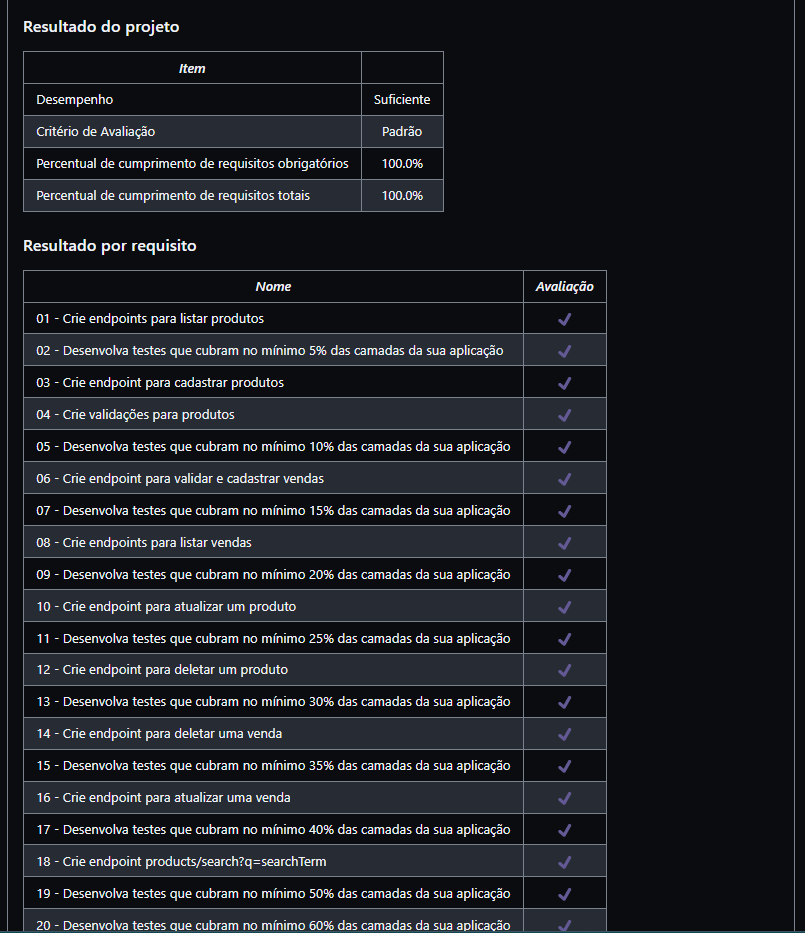

# Projet Store Manager

* O projeto tinha como objetivo a criação de uma API utilizando a arquitetura MSC (model-service-controller)!

* A API tem um sistema de gerenciamento de vendas no formato dropshipping em que é possível criar, visualizar, deletar e atualizar produtos e vendas. Utilizei o banco de dados MySQL para a gestão de dados. Usei os conteúdos do bloco para que a API fosse RESTful.

* Utilizei o mocha, chai e sinon para escrever os testes de unidade.

<details>
  <summary><strong>👨‍💻 Meu resultado no Projeto 22</strong></summary><br />

</details>

## 🚀 Tecnologias

* _Bash_
* _Docker_
* _MySQL_
* _Workbench_
* _Postmann_
* _Mocha_
* _Chai_
* _Sinon_

Instale as dependências:
```
npm install
```

Inicie a aplicação e faça as requisições para a porta 3000:

```
npm start
```

Rode os testes que fiz para cobrir mais de 50% da API com:
```
npm run test:mocha
```

Acesse a documentação da API usando a rota:
```
/docs
```

## 🚀 Habilidades

* Entender os conceitos básicos de como o JavaScript funciona;
* Detectar e solucionar problemas no código de forma mais objetiva;
* Entender a diferença entre execução síncrona e assíncrona;
* Entender o que é o HTTP, o que é uma API e o que os dois têm a ver com o Express;
* Escrever APIs utilizando Node e Express;
* Entender a estrutura de uma aplicação Express e como organizar seu código;
* Criar rotas e aplicar middlewares.
* Usar arquitetura MSC.
* Trabalhar com testes utilizando Mocha, Chai e Sinon.

<div> 
  <a href = "mailto:hsncorretor@gmail.com"></a>
  <a href="https://www.linkedin.com/in/henriquen-dev/" target="_blank"></a>
    <a href="https://instagram.com/henrique.s.nasc" target="_blank"></a> 
</div>
